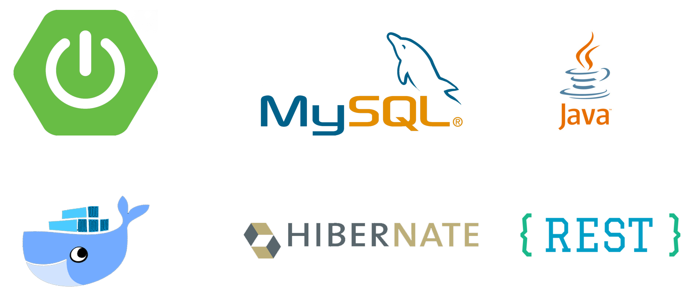

# Backend for Mission to Mars



## Architecture
This project uses Spring, Hibernate, MySQL, Java and Docker.
This project represents the backend of the whole project. 
The Model-Repository-Controller design pattern has been followed. Therefore there are two objects, Category and Item. Item has a foreign key pointing to a previously created category.
All the CRUD operations can be accesed by the controller and their routes have been exposed in order to call them in the front-end project.

## How to run it

Clone the repository and execute in the root folder:
```
docker-compose build
docker-compose up
```

Once it has been launched, it will be listening requests at the port 8087.

## Output JSON structure

Making a HTTP GET request to http://localhost:8087/api/categories will result in the following JSON:

```
[
    {
        "id": 1,
        "name": "Category 1",
        "priority": 1
    },
    {
        "id": 2,
        "name": "Category 2",
        "priority": 3
    }
]
```
HTTP GET http://localhost:8087/api/items
```
[
    {
        "id": 1,
        "name": "Item 1",
        "description": "Description for item 1",
        "weight": 5,
        "catId": 1
    }
]
```

More HTTP request can be found in https://github.com/JesusMSM/sap-test-frontend repository.
